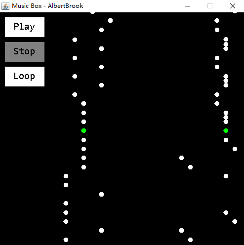

# 八音盒
## 运行
```
javac Main.java
java Main
```

## 说明
source文件夹放了wav格式的音阶片段，对音乐完全是小白，来之不易呀<br>
最开始的时候是用AudioClip来读取播放的，发现连续播放片段会有卡顿<br>
猜测是单线程的原因，给每一个片段一个线程还是会有卡顿<br>
最后改用sun包下的AudioPlayer还是有卡顿，使用多线程终于可以了<br>
<br>
Settings.java里放了两个变量track1,track2用来作为音轨<br>
有音源的可以自己添加更多音阶或者用其它的音源替换，比如葛平<br>
<br>
Track.java是一个迭代器类<br>
用于将好记的1234567转成相应的音阶片段<br>
可以将简谱转成可以用的字符串，通过字符串播放音阶片段<br>
1234567就是do,re,mi,fa,so,la,xi这7个基本音符<br>
-代表降一阶，+代表升一阶，所以一共可以播放27个音阶<br>
空格会跳过，可以辅助用，防止看得眼花<br>
<br>
Settings.java放了所有的参数<br>
可以通过修改它调整程序大小，颜色，音轨等等
## 纸带
#### 程序是模拟八音盒的，所以音轨就像是八音盒的纸带一样<br>
最开始最为测试用的两只老虎
```
track1 += "10203010102030103040500030405000565430105654301020-50100020-501000";
track2 += "0000000000000000000000000000000000000000000000000000000000000000";
```
天空之城
```
track1 += "00 00 00 67 +10 07 +10 +30 70 00 00 30 60 05 60 +10" +
        "50 00 00 43 40 03 40 +10 30 00 0+1 +1+1 70 04 40 70" +
        "70 00 00 67 +10 07 +10 +30 70 00 00 33 60 05 60 +10" +
        "50 00 00 30 40 +17 70 +10 +20 +3+1 +10 00 +17 60 70 50" +
        "60 00 00 +1+2 +30 0+2 +30 +50 +20 00 00 55 +10 07 +10 +30" +
        "+30 00 00 00 67 +10 7+1 +20 +10 05 50 00 +40 +30 +20 +10" +
        "+30 00 00 00 +30 00 00 +30 +60 00 +50 00 +30 +2+1 +10 00" +
        "+20 +1+2 +20 +50 +30 00 00 +30 +60 00 +50 00 +30 +2+1 +10 00" +
        "+20 +1+2 +20 70 60 00 00 67 +10 07 +10 +30 70 00 00 30" +
        "60 05 60 +10 50 00 00 43 40 03 40 +10 30 00 0+1 +1+1" +
        "70 04 40 70 70 00 00 67 +10 07 +10 +30 70 00 00 33" +
        "60 05 60 +10 50 00 00 30 40 +17 70 +10 +20 +3+1 +10 00" +
        "+10 70 60 00 70 00 50 00";
track2 += "00 00 00 00 -6-3 -61 30 00 -3-7 -3-5 -70 00 -4-1 -4-6 10 00" +
        "-1-5 13 50 00 -2-6 -2-4 -60 00 -6-3 -61 30 00 -3-7 -3-5 -70 00" +
        "-3-7 -3-5 -70 00 -6-3 -61 30 00 -3-7 -3-5 -70 00 -4-1 -4-6 10 00" +
        "-1-5 13 50 00 -2-5 -2-4 -60 00 -6-3 -61 30 00 -4-1 -4-6 10 00" +
        "-6-3 -61 30 00 -1-5 13 50 00 -5-2 -5-7 20 00 -6-3 -61 30 00" +
        "-3-7 -3-5 -70 00 -4-1 -4-1 -5-2 -5-2 -1-5 13 50 00 -2-6 -2-4 -60 00" +
        "-3-7 -3-5 -70 00 -3-7 -3-5 -70 00 -6-3 -6-3 -5-2 -5-2 -4-1 -4-6 10 00" +
        "-5-2 -5-7 20 00 -1-5 13 50 00 -6-3 -6-3 -5-2 -5-2 -4-1 -4-6 10 00" +
        "-5-2 -5-7 20 00 -6-3 -61 30 00 -6-3 -61 30 00 -3-7 -3-5 -70 00" +
        "-4-1 -4-6 10 00 -1-5 13 50 00 -2-6 -2-4 -60 00 -6-3 -61 30 00" +
        "-7-4 -7-2 -40 00 -3-7 -3-5 -70 00 -6-3 -61 30 00 -3-7 -3-5 -70 00" +
        "-4-1 -4-6 10 00 -1-5 13 50 00 -2-6 -2-4 -60 00 -6-3 -61 30 00" +
        "-40 -10 -40 -10 -30 -70 -30 -70";
```
超电磁炮only my railgun，因为太长了只码开头部分，剩余的以后再码<br>
这首音乐节奏比较快，天空之城是4拍的，这个是8拍的，把speed改成100比较好
```
track1 += "0060 6056 0060 5056 0060 6056 0060 5056 0060 6056 0060 5056 0060 6056 0060 5056" +
        "0060 6056 0060 5056 0060 6056 0060 5056 0060 6056 0060 5056 0060 6056 00+10 +70+50" +
        "+50+6+6 +60+50 +50+6+6 +60+50 +50+6+6 +60+60 +60+70 +10+20 +7000 +5000 +4000 +2000 +200+2 +20+30 00+10 +70+50" +
        "+50+6+6 +60+50 +50+6+6 +60+50 +50+6+6 +60+60 +60+70 +10+20 +6000 0000 +60+70 +10+20 +7000 +5000 +3000 +5000" +
        "+50+6+6 +60+10 +70+5+3 +30+50 +50+6+6 +6000 +6000 0000 +6000 0000 0000 0000";
track2 += "-6000 0000 0000 0000 -6000 0000 0000 0000 -6000 0000 0000 0000 -6000 0000 0000 0000" +
        "-6000 -6000 -6000 -6000 -6000 -6000 -6000 -6000 -6000 -6000 -6000 -6000 -6000 -6000 -1000 -0000" +
        "-60-30 -60-30 -60-30 -60-30 -40-40 -40-40 -40-40 -40-40 -50-50 -20-50 -50-50 -20-50 -10-50 -30-50 -70-70 -50-70" +
        "-60-30 -60-30 -60-30 -60-30 -40-40 -40-40 -40-40 -40-40 -20-20 -60-20 -20-20 -60-20 -30-30 -70-30 -30-30 -70-30" +
        "-40-10 -40-60 -50-50 -20-50 -6000 0000 0000 3000 1000 0000 0000 0000";
```